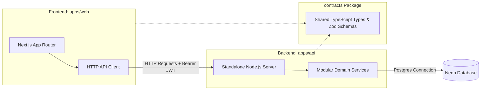

# Architectural Outcomes: Web Client & Server API Separation

This document defines the high-level goals, system topology, success metrics, and strategic architectural decisions for separating the **OneGoodArea** Next.js monolith into two distinct deployable units: a **Frontend Web Client** and a **Server API**.

For the concrete step-by-step development roadmap and file migration schedules, please refer to the companion:
👉 **[Detailed Implementation Plan](file:///home/perez/projetos/OneGoodArea/plan/separation_of_concerns_implementation.md)**

---

## 1. High-Level Goals & Benefits

1. **Absolute Separation of Concerns:**
   - **Frontend UI (`apps/web`):** Purely responsible for user experience, static page rendering, and interactive state management. Completely decoupled from database drivers, schemas, or SQL queries.
   - **Backend API (`apps/api`):** The sole custodian of business intelligence, database transactions, geographic calculation logic, PDF rendering, and external integrations (Stripe, Anthropic, Postcodes.io).
2. **Independent Scalability & Deployment Flexibility:**
   - The two units will compile independently and execute in isolation.
   - Enables hosting the Frontend on high-performance global CDNs (e.g., Vercel, Cloudflare Pages) while running the Backend on cost-efficient, dedicated container hosts (e.g., Render, AWS ECS, Fly.io) closer to the database.
3. **Optimized Development & Isolation:**
   - Eliminates database connection timeouts and environment variable leakage from the frontend runtime.
   - Encourages clean API-first practices, making it simple to swap front-end UI libraries or scale backend capabilities without logic collision.

---

## 2. Decoupled System Topology

---

## 3. Core Architectural Decisions

### Decision 1: Stateless Session JWT Bridge
*   **Approach:** Instead of sharing session databases or session cookies across servers, NextAuth (on the Frontend) signs a stateless JWT token containing user metadata (`user_id`, `email`, `role`) using a shared `AUTH_SECRET`. 
*   **Result:** Every front-end API call appends this JWT as a bearer token. The backend verifies the signature cryptographically without querying the database for session status, guaranteeing fast, decentralized authentication.

### Decision 2: Shared Typesafe Contracts (`packages/contracts`)
*   **Approach:** We will isolate Zod validation schemas and TypeScript DTO (Data Transfer Object) definitions in a lightweight shared packages workspace.
*   **Result:** Frontend and Backend share the exact same schema verification rules and request/response type definitions without sharing database code.

### Decision 3: Paid API-Key Gateway
*   **Approach:** Maintain a distinct dual-mode auth structure where programmatic clients (e.g., the local LLM-based **MCP Server**) authenticate using developer API keys (`aiq_...`), bypassing JWT session validation.

---

## 4. SMART Success Metrics

| Metric | Target | Measurement |
| :--- | :--- | :--- |
| **Fidelity Isolation** | **0** database client imports in `apps/web` | `npm run build` succeeds on frontend with `DATABASE_URL` deleted. |
| **API Coverage** | **100%** of backend endpoints covered | Automated integration tests in `apps/api` pass continuously. |
| **Deploy Independence** | **2** isolated deployable units | Successful standalone Docker build of `apps/api` and CDN bundle of `apps/web`. |
| **Transition Safety** | **0** main-branch runtime regressions | Branch-by-branch TDD delivery validation before logical merges. |

---

## 5. Summary of Module Boundaries

The backend architecture will be structured into 7 distinct domain-centric modules:
1. **`auth`:** Password hashing, credential validation, signup, and user roles.
2. **`reports`:** Core scoring engine calculations, generation caching, and PDF exports.
3. **`api-keys`:** Secure SHA-256 API key hashing, prefix previews, and validation.
4. **`usage`:** entiltements verification, API query counters, and rate limiting.
5. **`billing`:** Stripe checkout creation, portal redirection, and webhook idempotency.
6. **`tracking`:** JSON diagnostic logs and telemetry logging.
7. **`admin`:** Secure role-based metrics and analytical administration lookups.

👉 **[Go to separation_of_concerns_implementation.md to see the detailed development roadmap and file mappings](file:///home/perez/projetos/OneGoodArea/plan/separation_of_concerns_implementation.md)**
